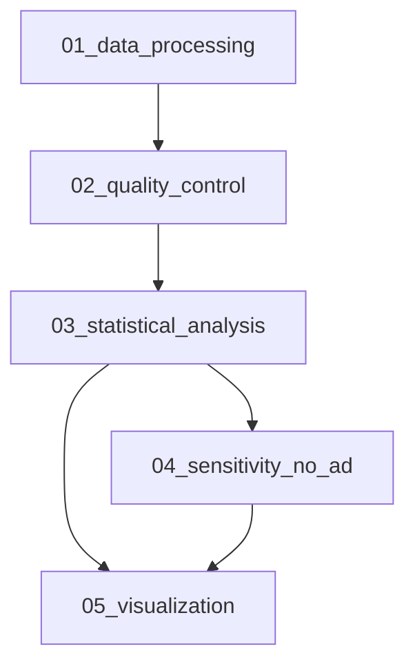

# ROSMAP-SI-Lipidomics

Self-contained analysis pipeline for studying social isolation and brain lipidomics associations in ROSMAP.

## Scientific Background

This project asks two primary questions:

1. Are social isolation scores (`SI_avg`) associated with lipid abundance across the lipidome?
2. Do those SI-lipid associations differ between males and females?

To answer these, the repository builds analysis-ready data from raw lipidomics + metadata, runs QC, fits per-lipid and category-level models, performs sensitivity analyses excluding AD pathology cases, and generates publication-oriented summary figures.

## Analysis Flow



## Repository Layout

```text
ROSMAP-SI-Lipidomics/
├── config.py
├── requirements.txt
├── data/
│   ├── README.md
│   ├── raw/
│   └── processed/
├── src/
│   ├── README.md
│   ├── data_utils.py
│   └── stats_utils.py
├── scripts/
│   ├── README.md
│   ├── 01_data_processing.py
│   ├── 02_quality_control.py
│   ├── 03_statistical_analysis.py
│   ├── 04_sensitivity_no_ad.py
│   └── 05_visualization.py
├── notebooks/
│   ├── README.md
│   ├── 01_data_processing.ipynb
│   ├── 02_quality_control.ipynb
│   ├── 03_statistical_analysis.ipynb
│   ├── 04_sensitivity_no_ad.ipynb
│   └── 05_visualization.ipynb
└── results/
    ├── README.md
    ├── figures/
    └── tables/
```

## Getting Started

### 1) Clone and enter the repo

```bash
git clone https://github.com/Environmental-And-Social-Epigenetics/ROSMAP-SI-Lipidomics.git
cd ROSMAP-SI-Lipidomics
```

### 2) Install dependencies

```bash
python -m pip install -r requirements.txt
```

### 3) Obtain data

Place required source CSVs into `data/raw/` in the folder structure documented in `data/README.md`.

### 4) Choose run mode

- **Script-first (recommended for reproducibility):** run Python scripts in sequence.
- **Notebook-first (recommended for walkthroughs):** run notebooks in sequence.

## Running the Analysis

### Script-first pipeline

```bash
python scripts/01_data_processing.py
python scripts/02_quality_control.py
python scripts/03_statistical_analysis.py
python scripts/04_sensitivity_no_ad.py
python scripts/05_visualization.py
```

### Notebook-first pipeline

Run these notebooks in order:

1. `notebooks/01_data_processing.ipynb`
2. `notebooks/02_quality_control.ipynb`
3. `notebooks/03_statistical_analysis.ipynb`
4. `notebooks/04_sensitivity_no_ad.ipynb`
5. `notebooks/05_visualization.ipynb`

## Pipeline Steps (What each step does)

### Step 01: Data Processing

Script: `scripts/01_data_processing.py`  
Notebook: `notebooks/01_data_processing.ipynb`

- Loads raw lipidomics and metadata tables
- Maps `projid -> individualID`
- Converts lipidomics matrix into sample-by-lipid format
- Applies internal-standard normalization
- Attaches model covariates
- Writes:
  - `data/processed/Normalized_Formatted_Lipidomics.csv`
  - `data/processed/Final_Formatted_Lipidomics.csv`

### Step 02: Quality Control

Script: `scripts/02_quality_control.py`  
Notebook: `notebooks/02_quality_control.ipynb`

- Runs Local Outlier Factor (LOF) outlier diagnostics
- Runs Shapiro-Wilk normality checks across lipids
- Applies FDR correction
- Writes tables and QC figures to `results/`

### Step 03: Statistical Analysis (includes ANCOVA)

Script: `scripts/03_statistical_analysis.py`  
Notebook: `notebooks/03_statistical_analysis.ipynb`

- Runs per-lipid OLS in all/male/female cohorts
- Runs category-mean models
- Runs pooled ANCOVA interaction model:
  - `lipid ~ SI_avg * msex + niareagansc + age_death`
- Writes:
  - `results/tables/stats_lipid_*.csv`
  - `results/tables/stats_category_*.csv`
  - `results/tables/ancova_sex_lipid.csv`
  - `results/tables/ancova_sex_category.csv`

### Step 04: Sensitivity Analysis (No AD)

Script: `scripts/04_sensitivity_no_ad.py`  
Notebook: `notebooks/04_sensitivity_no_ad.ipynb`

- Filters to `niareagansc > 2`
- Repeats primary models in all/male/female cohorts
- Adds z-score scaling sensitivity pass
- Writes `results/tables/sensitivity_noad_*`

### Step 05: Visualization

Script: `scripts/05_visualization.py`  
Notebook: `notebooks/05_visualization.ipynb`

- Builds volcano plots for all/male/female main analyses
- Builds ANCOVA interaction volcano plot
- Builds category effect-size barplot
- Builds top lipid-vs-SI scatter/regression figures

## Interpreting the Sex Interaction (ANCOVA)

The key term is `SI_avg:msex`:

- `coef_interaction`: direction/magnitude of sex difference in SI effect
- `p_interaction`: nominal significance of that difference
- `fdr_p_interaction`: multiple-testing-adjusted significance across lipids

Use `results/tables/ancova_sex_lipid.csv` and `results/figures/volcano_sex_interaction.png` to identify robust sex-differential SI associations.

## Where to look next

- `scripts/README.md` for CLI details
- `notebooks/README.md` for guided interactive workflow
- `src/README.md` for utility/API overview
- `results/README.md` for output interpretation
- `data/README.md` for data inventory and acquisition notes
